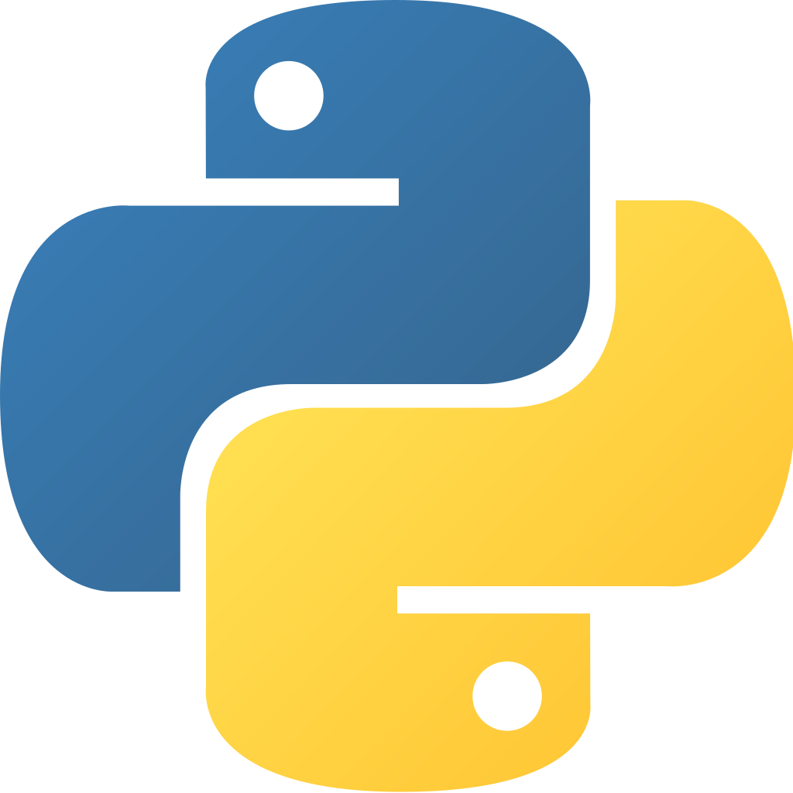

# Python-for-DevOps-Engineers


  

## Hello World

<details>
<summary><b><i>1.How to print "Hello World"?</i></b></summary>

$\color{green}{\text{Answer}}$

```Python
print("Hello World")
```

</details>

<details>
<summary><b><i>2.How to print "Hello Amazing" and then print "World" on the same line? (to clarify, you should use two print statements)</i></b></summary>

$\color{green}{\text{Answer}}$

```Python
print("Hello Amazing", end=" ")
print("World")
```

</details>

<details>
<summary><b><i>3.The following program reads two numbers from the user.
  
```Python
x = int(input())
y = int(input())
```

Print the sum and the difference between the numbers

</i></b></summary>

$\color{green}{\text{Answer}}$

`print(x + y)`

`print(x - y)`

</details>

## Conditionals

<details>
<summary><b><i>4.Read a number from the user and check whether it's even. If it's even, print "yay". If it's not, print "nay"</i></b></summary>

$\color{green}{\text{Answer}}$

```Python
x = int(input())

if x % 2 == 0:
  print("yay")
else:
  print("nay")
```

</details>

## Loops

<details>
<summary><b><i>5.Given an integer (n), print all the numbers between 0 and n (including n)</i></b></summary>

$\color{green}{\text{Answer}}$

```Python
for i in range(n + 1):
  print(i)
```

</details>

<details>
<summary><b><i>6.Given an integer (n), print all the numbers between 0 and n (including n) that are even</i></b></summary>

$\color{green}{\text{Answer}}$

```Python
for i in range(n + 1):
  if i % 2 == 0:
    print(i)
```

</details>

## Classes

<details>
<summary><b><i>7.Define a class that does nothing</i></b></summary>

$\color{green}{\text{Answer}}$

```Python
class SomeClass:
  pass
```

</details>

<details>
<summary><b><i>8.True or False? If `c` is an instance of a class, then in `c.x = 1`, `x` is a variable of the value 1</i></b></summary>

$\color{green}{\text{Answer}}$

False. `x` is an attribute in the case `c.x = 1`

</details>

<details>
<summary><b><i>9.True or False? Every object in Python has attributes</i></b></summary>

$\color{green}{\text{Answer}}$

True. You can think on attributes as private dictionaries but instead of accessing them with `[]` or `.get`, they are accessed by using a dot.

</details>

<details>
<summary><b><i>10.True or False? As opposed to variables, attributes can't contain any Python object, only several selected types</i></b></summary>

$\color{green}{\text{Answer}}$

False. Like variables, attributes can contain any Python object.

</details>

## Strings

<details>
<summary><b><i>11.How to convert `"2 0 1 7"` to the list `[2, 0, 1, 7]`?</i></b></summary>

$\color{green}{\text{Answer}}$

```Python
[int(i) for in in "2 0 1 7".split()]
```

</details>

## Lists

<details>
<summary><b><i>12.How to remove duplicates from a given sorted list?</i></b></summary>

$\color{green}{\text{Answer}}$

```Python
def remove_duplicates(sorted_list):
  if not sorted_list:
    return []
  unique_elements = [sorted_list[0]]

  for item in sorted_list[1:]:
    if item != unique_elements[-1]:
      unique_elements.append(item)

  return unique_elements
```

</details>

## OOP

<details>
<summary><b><i>13.Explain inheritance and how to use it in Python</i></b></summary>

$\color{green}{\text{Answer}}$

Inheritance is a fundamental concept in Object-Oriented Programming (OOP) where a new class, called the child class (or subclass/derived class), derives properties and methods from an existing class, called the parent class (or superclass/base class).

This allows for:

1. <b>Code Reusability</b>: Properties and methods defined in the parent class are available in the child class.

2. <b>Creating a hierarchy</b>: Modeling an "is-a" relationship (e.g., a "Dog" is a "Mammal").

To create a child class that inherits from a parent class, you specify the parent class name inside parentheses when defining the child class:

```Python
class Animal:
  def __init__(self, name):
    self.name = name

  def speak(self):
    return f"{self.name} makes a sound."

class Dog(Animal):
  def speak(self):
    parent_sound = super().speak()
    retun f"{self.name} barks! ({parent_sound})"

my_dog = Dog("Buddy")
print(my_dog.speak())
```

</details>

<details>
<summary><b><i>14.Explain and demonstrate class attributes & instance attributes</i></b></summary>

$\color{green}{\text{Answer}}$

In the following block of code `x` is a class attribute while `self.y` is a instance attribute

```Python
class MyClass(object):
  x = 1

  def __init__(self, y):
    self.y = y
```

</details>

## Exceptions

<details>
<summary><b><i>15.What is an error? What is an exception? What types of exceptions are you familiar with?</i></b></summary>

$\color{green}{\text{Answer}}$

Note that you generally don't need to know the compiling process but knowing where everything comes from and giving complete answers shows that you truly know what you are talking about.

Generally, every compiling process have a two steps.
  - Analysis
  - Code Generation.

Analysis can be broken into:

1. Lexical analysis   (Tokenizes source code)

2. Syntactic analysis (Check whether the tokens are legal or not, tldr, if syntax is correct)

```Python
for i in 'foo'
            `^`
SyntaxError: invalid syntax

We missed ':'
```

3. Semantic analysis  (Contextual analysis, legal syntax can still trigger errors, did you try to divide by 0, hash a mutable object or use an undeclared function?)

```Python
1/0
ZeroDivisionError: division by zero
```

These three analysis steps are the responsible for error handlings.

The second step would be responsible for errors, mostly syntax errors, the most common error.

The third step would be responsible for Exceptions.

As we have seen, Exceptions are semantic errors, there are many builtin Exceptions:

```Python
ImportError
ValueError
KeyError
FileNotFoundError
IndentationError
IndexError
...
```

You can also have user defined Exceptions that have to inherit from the `Exception` class, directly or indirectly.

Basic example:

```Python
class DividedBy2Error(Exception):
  def __init__(self, message):
    self.message = message


def division(dividend,divisor):
  if divisor == 2:
    raise DividedBy2Error('I dont want you to divide by 2!')
  return dividend / divisor

division(100, 2)
```

</details>

<details>
<summary><b><i>16.Explain Exception Handling and how to use it in Python</i></b></summary>

$\color{green}{\text{Answer}}$

Exceptions: Errors detected during execution are called Exceptions.

Handling Exception: When an error occurs, or exception as we call it, Python will normally stop and generate an error message.

Exceptions can be handled using `try` and `except` statement in python.

Example: Following example asks the user for input until a valid integer has been entered.

If user enter a non-integer value it will raise exception and using except it will catch that exception and ask the user to enter valid integer again.

```Python
while True:
   try:
        a = int(input("please enter an integer value: "))
        break
    except ValueError:
        print("Ops! Please enter a valid integer value.")
```

</details>

<details>
<summary><b><i>17.What is the result of running the following function?

```Python
def true_or_false():
  try:
    return True
  finally:
    return False
```

</i></b></summary>

$\color{green}{\text{Answer}}$

```Python
False
```

</details>

## Built-in Functions

<details>
<summary><b><i>19.Explain the following built-in functions (their purpose + use case example):
- repr
- any
- all
</i></b></summary>

$\color{green}{\text{Answer}}$

1.`repr()`
  - Returns a "printable" string representation of an object that should look like a valid Python expression (used for debugging/logging).
  - Seeing the "true" value of a variable (e.g., distinguishing between a string and its content).
    ```Python
    s = "Hello"
    print(repr(s))
    # Output: 'Hello'
    ```
   
2.`any()`
  - Returns `True` if at least one element in an iterable is true. If the iterable is empty, it returns `False`.
  - Checking if any item in a list meets a condition.
    ```Python
    results = [False, 0, "Exists", False]
    print(any(results))
    # Output: True
    ```
   
3.`all()`
  - Returns `True` if all elements in an iterable are true (or if the iterable is empty). 
  - Ensuring every requirement in a checklist is completed.
    ```Python
    scores = [100, 95, 88, 92]
    print(all(s > 80 for s in scores))
    # Output: True
    ```

</details>

<details>
<summary><b><i>20.What is the difference between repr function and str?</i></b></summary>

$\color{green}{\text{Answer}}$

<b>Reconstruction</b>: Ideally, `repr()` should return a string that looks like the code used to create the object (so `eval(repr(obj)) == obj`).

<b>Fallback Behavior</b>: If you don't define `__str__` in a class, Python will use `__repr__` as a backup. However, it does not work the other way around.

<b>Containers</b>: When you print a list or dictionary, Python uses `repr()` for the items inside, even if you called `str()` on the container itself.

</details>

<details>
<summary><b><i>21.What is the __call__ method?</i></b></summary>

$\color{green}{\text{Answer}}$

It is used to emulate callable objects. It allows a class instance to be called as a function.

Example code:

```Python
class Foo:
  def __init__(self: object) ->  None:
    pass

  def __call__(self: object) -> None:
    print("Called!")`

f = Foo()
f()
 ```
 
Result:

```Python
Called!
```

</details>

<details>
<summary><b><i>22.Do classes has the __call__ method as well? What for?</i></b></summary>

$\color{green}{\text{Answer}}$

Yes, classes can have a `__call__` method. Defining `__call__` allows an instance of a class to be called like a regular function (using parentheses). It essentially turns an object into a callable.

- <b>Maintaining State</b>: To create "functions" that remember data between calls without using global variables.

- <b>Functional Programming</b>: When you need an object to behave like a function (e.g., for decorators or callbacks) but still need the structure of a class.

</details>

<details>
<summary><b><i>23.What _ is used for in Python?</i></b></summary>

$\color{green}{\text{Answer}}$

1.Translation lookup in i18n

2.Hold the result of the last executed expression or statement in the interactive interpreter.

3.As a general purpose "throwaway" variable name. For example: x, y, _ = get_data() (x and y are used but since we don't care about third variable, we "threw it away").

</details>

<details>
<summary><b><i>24.Explain what is GIL</i></b></summary>

$\color{green}{\text{Answer}}$

Python Global Interpreter Lock (GIL) is a type of process lock which is used by python whenever it deals with processes. Generally, Python only uses only one thread to execute the set of written statements. This means that in python only one thread will be executed at a time.

</details>

<details>
<summary><b><i>25.What is Lambda? How is it used?</i></b></summary>

$\color{green}{\text{Answer}}$

A lambda expression is an 'anonymous' function, the difference from a normal defined function using the keyword `def` is the syntax and usage.

The syntax is:

```Python
lambda[parameters]: [expresion]
```

Examples:
  
A lambda function add 10 with any argument passed.
  ```Python
  x = lambda a: a + 10
  print(x(10))
  ```

An addition function
  ```Python
  addition = lambda x, y: x + y
  print(addition(10, 20))
  ```

Squaring function
  ```Python
  square = lambda x : x ** 2
  print(square(5))
  ```

Generally it is considered a bad practice under PEP 8 to assign a lambda expresion, they are meant to be used as parameters and inside of other defined functions.

</details>

## Properties

<details>
<summary><b><i>26.Are there private variables in Python? How would you make an attribute of a class, private?</i></b></summary>

$\color{green}{\text{Answer}}$

Technically, no. Python does not have strict "private" variables like Java or C++. All attributes are technically accessible.

However, Python uses naming conventions to signal intent:

1. <b>Protected (Internal Use)</b>: Prefix an attribute with a single underscore `_`
    ```Python
    self._value = 10
    ```

2. <b>Private (Name Mangling)</b>: Prefix an attribute with a double underscore `__`
    ```Python
    self.__secret = 42
    ```

</details>    
   
<details>
<summary><b><i>27.Explain the following:</i></b></summary>

$\color{green}{\text{Answer}}$

1. <b>getter</b> -> The Getter retrieves the value of a private attribute.
    ```Python
    @property
    ```
    Allows read-access and data formatting before returning.

2. <b>setter</b> -> The Setter updates the value of an attribute.
    ```Python
    @<attribute_name>.setter
    ```
    Enables validation (e.g., ensuring a price isn't negative) before saving data.

3. <b>deleter</b> -> The Deleter handles the cleanup when an attribute is deleted using `del`
    ```Python
    @<attribute_name>.deleter
    ```
    Useful for logging deletions or resetting related values.

</details>

<details>
<summary><b><i>28.Explain what is @property</i></b></summary>

$\color{green}{\text{Answer}}$

The `@property` decorator is a built-in tool that turns a class method into a "virtual" attribute. It allows you to access a method's return value using simple dot notation (e.g., `obj.price`) instead of calling it like a function (`obj.price()`). This is primarily used to implement encapsulation: you can start with a simple public attribute and later wrap it in logic (like validation or logging) without changing the external API of your class.

</details>

<details>
<summary><b><i>29.How do you swap values between two variables?</i></b></summary>

$\color{green}{\text{Answer}}$

```Python
x, y = y, x
```

</details>

<details>
<summary><b><i>30.Explain the following object's magic variables:</i></b></summary>

$\color{green}{\text{Answer}}$

<b>dict</b> - A magic attribute that stores an object's writable attributes in a dictionary format. It maps attribute names (keys) to their current values (values).

</details>

<details>
<summary><b><i>31.Write a function to return the sum of one or more numbers. The user will decide how many numbers to use</i></b></summary>

$\color{green}{\text{Answer}}$

First you ask the user for the amount of numbers that will be use. Use a while loop that runs until amount_of_numbers becomes 0 through subtracting amount_of_numbers by one each loop. In the while loop you want ask the user for a number which will be added a variable each time the loop runs.

```Python
def return_sum():
  amount_of_numbers = int(input("How many numbers? "))
  total_sum = 0
    
  while amount_of_numbers != 0:
    num = int(input("Input a number. "))
    total_sum += num
    amount_of_numbers -= 1
        
return total_sum
```

</details>

<details>
<summary><b><i>32.Print the average of 
  
```Python
[2, 5, 6]
```

It should be rounded to 3 decimal places

</i></b></summary>

$\color{green}{\text{Answer}}$

```Python
li = [2, 5, 6]
print(f"{sum(li)/len(li):.3f}")
```

</details>

## Lists

<details>
<summary><b><i>33.What is a tuple in Python? What is it used for?</i></b></summary>

$\color{green}{\text{Answer}}$

A tuple is a built-in data type in Python. It's used for storing multiple items in a single variable.

</details>

<details>
<summary><b><i>34.List, like a tuple, is also used for storing multiple items. What is then, the difference between a tuple and a list?</i></b></summary>

$\color{green}{\text{Answer}}$

List, as opposed to a tuple, is a mutable data type. It means we can modify it and at items to it.

</details>

<details>
<summary><b><i>35.How to add the number 2 to the list `x = [1, 2, 3]`</i></b></summary>

$\color{green}{\text{Answer}}$

```Python
x.append(2)
```

</details>

<details>
<summary><b><i>36.How to get the last element of a list?</i></b></summary>

$\color{green}{\text{Answer}}$

```Python
some_list[-1]
```

</details>

<details>
<summary><b><i>37.How to add the items of `[1, 2, 3]` to the list `[4, 5, 6]`?</i></b></summary>

$\color{green}{\text{Answer}}$

```Python
x = [4, 5, 6]` `x.extend([1, 2, 3])
```

Don't use append unless you would like the list as one item.

</details>

<details>
<summary><b><i>38.How to remove the first 3 items from a list?</i></b></summary>

$\color{green}{\text{Answer}}$

```Python
my_list[0:3] = []
```

</details>

<details>
<summary><b><i>39.How to insert an item to the beginning of a list? What about two items?</i></b></summary>

$\color{green}{\text{Answer}}$

One item:
  ```Python
  numbers = [1, 2, 3, 4, 5]
  numbers.insert(0, 0)
  print(numbers)
  ```

Multiple items or list:
  ```Python
  numbers_1 = [2, 3, 4, 5]
  numbers_2 = [0, 1]
  numbers_1 = numbers_2 + numbers_1
  print(numbers_1)
  ```

</details>

<details>
<summary><b><i>40.How to sort list by the length of items?</i></b></summary>

$\color{green}{\text{Answer}}$

```Python
sorted_li = sorted(li, key=len)
```

Or without creating a new list:
```Python
li.sort(key=len)
```

</details>

<details>
<summary><b><i>41.Do you know what is the difference between list.sort() and sorted(list)?</i></b></summary>

$\color{green}{\text{Answer}}$

`sorted(list)` will return a new list (original list doesn't change)

`list.sort()` will return None but the list is change in-place

`sorted()` works on any iterable (Dictionaries, Strings, ...)

`list.sort()` is faster than sorted(list) in case of Lists

</details>

<details>
<summary><b><i>42.Convert every string to an integer: 
  
```Python
[['1', '2', '3'], ['4', '5', '6']]
```

</i></b></summary>

$\color{green}{\text{Answer}}$

```Python
nested_li = [['1', '2', '3'], ['4', '5', '6']]
[[int(x) for x in li] for li in nested_li]
```

</details>

<details>
<summary><b><i>43.How to merge two sorted lists into one sorted list?</i></b></summary>

$\color{green}{\text{Answer}}$

```Python
sorted(li1 + li2)
```

Another way:

```Python
i, j = 0, 0
merged_li = []

while i < len(li1) and j < len(li2):
  if li1[i] < li2[j]:
    merged_li.append(li1[i])
    i += 1
  else:
    merged_li.append(li2[j])
    j += 1
```

</details>

<details>
<summary><b><i>44.How to check if all the elements in a given lists are unique? so [1, 2, 3] is unique but [1, 1, 2, 3] is not unique because 1 exists twice</i></b></summary>

$\color{green}{\text{Answer}}$

There are many ways of solving this problem:

`# Note: :list and -> bool are just python typings, they are not needed for the correct execution of the algorithm.`

Taking advantage of sets and len:

```Python
def is_unique(l:list) -> bool:
  return len(set(l)) == len(l)
```

This one is can be seen used in other programming languages.

```Python
def is_unique2(l: list) -> bool:
  seen = [] 

  for i in l:
    if i in seen:
      return False
    seen.append(i)
  return True
```

Here we just count and make sure every element is just repeated once.

```Python
def is_unique3(l: list) -> bool:
  for i in l:
    if l.count(i) > 1: 
      return False
  return True
```

This one might look more convulated but hey, one liners.

```Python
def is_unique4(l: list) -> bool:
  return all(l.count(x) < 2 for x in l)
```

</details>

<details>
<summary><b><i>45.You have the following function

```Python
def my_func(li = []):
  li.append("hmm")
  print(li)
```

If we call it 3 times, what would be the result each call?

</i></b></summary>

$\color{green}{\text{Answer}}$

```Python
['hmm']
```

```Python
['hmm','hmm']
```

```Python
['hmm','hmm','hmm']
```

</details>

<details>
<summary><b><i>46.How to iterate over a list?</i></b></summary>

$\color{green}{\text{Answer}}$

```Python
for item in some_list:
  print(item)
```

</details>

<details>
<summary><b><i>47.How to iterate over a list with indexes?</i></b></summary>

$\color{green}{\text{Answer}}$

```Python
for i, item in enumerate(some_list):
  print(i)
```

</details>

<details>
<summary><b><i>48.How to start list iteration from 2nd index?</i></b></summary>

$\color{green}{\text{Answer}}$

Using range like this

```Python
for i in range(1, len(some_list)):
  some_list[i]
```


Another way is using slicing

```Python
for i in some_list[1:]:
```

</details>
 
<details>
<summary><b><i>49.How to iterate over a list in reverse order?</i></b></summary>

$\color{green}{\text{Answer}}$

Method 1

```Python
for i in reversed(li):
  ...
```

Method 2

```Python
n = len(li) - 1
while n > 0:
  ...
  n -= 1
```

</details>

<details>
<summary><b><i>50.Sort a list of lists by the second item of each nested list</i></b></summary>

$\color{green}{\text{Answer}}$

```Python
li = [[1, 4], [2, 1], [3, 9], [4, 2], [4, 5]]
sorted(li, key=lambda l: l[1])
```

or

```Python
li.sort(key=lambda l: l[1)
```

</details>

<details>
<summary><b><i>51.Combine [1, 2, 3] and ['x', 'y', 'z'] so the result is [(1, 'x'), (2, 'y'), (3, 'z')]</i></b></summary>

$\color{green}{\text{Answer}}$

```Python
nums = [1, 2, 3]
letters = ['x', 'y', 'z']

print(list(zip(nums, letters)))
```

</details>

<details>
<summary><b><i>52.What is List Comprehension? Is it better than a typical loop? Why? Can you demonstrate how to use it?</i></b></summary>

$\color{green}{\text{Answer}}$

List comprehensions provide a concise way to create lists. Common applications are to make new lists where each element is the result of some operations applied to each member of another sequence or iterable, or to create a subsequence of those elements that satisfy a certain condition.

It's better because they're compact, faster and have better readability.

For loop:

```Python
number_lists = [[1, 7, 3, 1], [13, 93, 23, 12], [123, 423, 456, 653, 124]]
odd_numbers = []

for number_list in number_lists:
  for number in number_list:
    if number % 2 != 0:
      odd_numbers.append(number)

print(odd_numbers)
```

List comprehesion:

```Python
number_lists = [[1, 7, 3, 1], [13, 93, 23, 12], [123, 423, 456, 653, 124]]

odd_numbers = [number for number_list in number_lists for number in number_list if number % 2 != 0]

print(odd_numbers)
```

</details>

<details>
<summary><b><i>53.You have the following list: 
  
```Python
[{'name': 'Mario', 'food': ['mushrooms', 'goombas']}, {'name': 'Luigi', 'food': ['mushrooms', 'turtles']}]
```

Extract all type of foods. Final output should be:

```Python
{'mushrooms', 'goombas', 'turtles'}
```

</i></b></summary>

$\color{green}{\text{Answer}}$

```Python
brothers_menu = [
    {'name': 'Mario', 'food': ['mushrooms', 'goombas']}, 
    {'name': 'Luigi', 'food': ['mushrooms', 'turtles']}
]

unique_food = set([food for bro in brothers_menu for food in bro['food']])
print(unique_food)
```

</details>

## Dictionaries

<details>
<summary><b><i>54.How to create a dictionary?</i></b></summary>

$\color{green}{\text{Answer}}$

1. The Literal Syntax:
```Python 
my_dict = dict(x=1, y=2)
```

OR 

2. The Keyword Constructor:

```Python
my_dict = {'x': 1, 'y': 2}
```

OR 

3. The Iterable Constructor:

```Python
my_dict = dict([('x', 1), ('y', 2)])
```

</details>

<details>
<summary><b><i>55.How to remove a key from a dictionary?</i></b></summary>

$\color{green}{\text{Answer}}$

```Python
del my_dict['some_key']
```

You can also use 

```Python
my_dict.pop('some_key')
```

which returns the value of the key.

</details>

<details>
<summary><b><i>56.How to sort a dictionary by values?</i></b></summary>

$\color{green}{\text{Answer}}$

```Python
{k: v for k, v in sorted(x.items(), key=lambda item: item[1])}
```

</details>

<details>
<summary><b><i>57.How to sort a dictionary by keys?</i></b></summary>

$\color{green}{\text{Answer}}$

```Python
dict(sorted(some_dictionary.items()))
```

</details>

<details>
<summary><b><i>58.How to merge two dictionaries?</i></b></summary>

$\color{green}{\text{Answer}}$

```Python
some_dict1.update(some_dict2)
```

</details>

<details>
<summary><b><i>59.Convert the string "a.b.c" to the dictionary 
  
```Python
{'a': {'b': {'c': 1}}}
```

</i></b></summary>

$\color{green}{\text{Answer}}$

```Python
from functools import reduce

output = {}
string = "a.b.c"
path = string.split('.')

target = reduce(lambda d, k: d.setdefault(k, {}), path[:-1], output)
target[path[-1]] = 1

print(output)
```

</details>

## Common Algorithms Implementation

<details>
<summary><b><i>60.Can you implement "binary search" in Python?</i></b></summary>

$\color{green}{\text{Answer}}$

```Python
def binary_search(arr, target):
  low, high = 0, len(arr) - 1

  while low <= high:
    mid = (low + high) // 2
        
    if arr[mid] == target:
      return mid
    elif arr[mid] < target:
      low = mid + 1
    else:
      high = mid - 1
            
return -1
```

</details>

## Files

<details>
<summary><b><i>61.How to write to a file?</i></b></summary>

$\color{green}{\text{Answer}}$

```Python
with open('file.txt', 'w') as file:
    file.write("My insightful comment")
```

</details>

<details>
<summary><b><i>62.Sum all the integers in a given file</i></b></summary>

$\color{green}{\text{Answer}}$

```Python
def sum_file_integers(filename):
  with open(filename, 'r') as f:
    return sum(int(w) for line in f for w in line.split() if w.isdigit())
```

</details>

<details>
<summary><b><i>63.Print a random line of a given file</i></b></summary>

$\color{green}{\text{Answer}}$

```Python
import random

with open('file.txt', 'r') as f:
  lines = f.readlines()

if lines: 
  print(random.choice(lines).strip())
else:
  print("The file is empty, nothing to choose from!")
```

</details>
 
<details>
<summary><b><i>64.Print every 3rd line of a given file</i></b></summary>

$\color{green}{\text{Answer}}$

```Python
from itertools import islice
  with open('file.txt', 'r') as f:
    for line in islice(f, 2, None, 3):
      print(line.strip())
```

</details>

<details>
<summary><b><i>65.Print the number of lines in a given file</i></b></summary>

$\color{green}{\text{Answer}}$

```Python
with open('file.txt', 'r') as f:
  print(len(f.readlines()))
```

</details>

<details>
<summary><b><i>66.Print the number of of words in a given file</i></b></summary>

$\color{green}{\text{Answer}}$

```Python
print(len(open('file.txt').read().split()))
```

</details>

<details>
<summary><b><i>67.Can you write a function which will print all the file in a given directory? including sub-directories</i></b></summary>

$\color{green}{\text{Answer}}$

```Python
from pathlib import Path
def print_files(directory):
  for path in Path(directory).rglob('*'):
    if path.is_file():
      print(path)

print_files('your_directory_path')
```

</details>

<details>
<summary><b><i>68.Write a dictionary (variable) to a file</i></b></summary>

$\color{green}{\text{Answer}}$

```Python
import json
with open('file.json', 'w') as f:
  f.write(json.dumps(dict_var))
```

</details>

## OS

**_69.How to print current working directory?_**

- `import os`
- `print(os.getcwd())`

**_70.Given the path `/dir1/dir2/file1` print the file name (file1)_**

- `import os`

- `print(os.path.basename('/dir1/dir2/file1'))`

# Another way
- `print(os.path.split('/dir1/dir2/file1')[1])`

**_71.Given the path `/dir1/dir2/file1`_**
- **_1. Print the path without the file name (/dir1/dir2)_**
- **_2. Print the name of the directory where the file resides (dir2)_**

- `import os`
- ## Part 1.
- # os.path.dirname gives path removing the end component
- `dirpath = os.path.dirname('/dir1/dir2/file1')`
- `print(dirpath)`

- ## Part 2.
- `print(os.path.basename(dirpath))`

**_72.How do you execute shell commands using Python?_**

- `import subprocess`

- # Simple command
- `subprocess.run(["ls", "-l"])`

- # Capture output to a variable
- `result = subprocess.run(["echo", "Hello World"], capture_output=True, text=True)`
- `print(result.stdout)`

**_73.How do you join path components? for example `/home` and `/luig` will result in `/home/luigi`_**

- `from pathlib import Path`

- `path = Path("/home") / "luigi"`
- `print(path)`

**_74.How do you remove non-empty directory?_**

- `import shutil`

- `shutil.rmtree('/path/to/directory')`

## Regex

<details>
<summary><b><i>75.How do you perform regular expressions related operations in Python? (match patterns, substitute strings, etc.)</i></b></summary>

$\color{green}{\text{Answer}}$

Using the re module

</details>

<details>
<summary><b><i>76.How to find all the IP addresses in a variable? How to find them in a file?</i></b></summary>

$\color{green}{\text{Answer}}$

```Python
import re

ip_pattern = re.compile(r'\b(?:\d{1,3}\.){3}\d{1,3}\b')
found_ips = []

with open('server.log', 'r') as file:
  for line in file:
    found_ips.extend(ip_pattern.findall(line))
```

</details>

## Strings

**_77.Find the first repeated character in a string_**

- While you iterate through the characters, store them in a dictionary and check for every character whether it's already in the dictionary.

- `def firstRepeatedCharacter(str):`
  - `chars = {}`
  - `for ch in str:`
    - `if ch in chars:`
      - `return ch`
    - `else:`
      - `chars[ch] = 0`
     
**_78.How to extract the unique characters from a string? for example given the input "itssssssameeeemarioooooo" the output will be "mrtisaoe"_**

- `x = "itssssssameeeemarioooooo"`
- `y = ''.join(set(x))`

**_79.Find all the permutations of a given string_**

- `def permute_string(string):`

  - `if len(string) == 1:`
    - `return [string]`

  - `permutations = []`
  - `for i in range(len(string)):`
    - `swaps = permute_string(string[:i] + string[(i+1):])`
    - `for swap in swaps:`
      - `permutations.append(string[i] + swap)`

  - `return permutations`

- `print(permute_string("abc"))`

**_80.How to check if a string contains a sub string?_**

- `text = "Hello, Luigi!"`

- `if "Luigi" in text:`
  - `print("Found it!")`
 
**_81.Find the frequency of each character in string_**

- `from collections import Counter`

- `text = "banana"`
- `frequency = Counter(text)`

- `print(frequency)`

**_82.Count the number of spaces in a string_**

- You can use the "count" method like this:
  - `ImAString.count(" ")`
 
**_83.Given a string, find the N most repeated words_**

- `import re`
- `from collections import Counter`

- `text = "apple banana apple cherry banana apple"`
- `n = 2`

- `words = re.findall(r'\w+', text.lower())`

- `most_common = Counter(words).most_common(n)`

- `print(most_common)`

**_84.Given the string (which represents a matrix) "1 2 3\n4 5 6\n7 8 9" create rows and colums variables (should contain integers, not strings)_**

- `matrix_str = "1 2 3\n4 5 6\n7 8 9"`

- `rows = [[int(x) for x in line.split()] for line in matrix_str.split('\n')]`

- `cols = list(zip(*rows))`

- `print(f"Rows: {rows}")`
- `print(f"Cols: {cols}")`

**_85.What is the result of each of the following?_**
- **_`', '.join(["One", "Two", "Three"])`_**
- **_`" ".join("welladsadgadoneadsadga".split("adsadga")[:2])`_**
- **_`"".join(["c", "t", "o", "a", "o", "q", "l"])[0::2]`_**

- `'One, Two, Three'`
- `'well done'`
- `'cool'`

**_86.If `x = "pizza"`, what would be the result of `x[::-1]`?_**

- It will reverse the string, so x would be equal to `azzip`.

**_87.Reverse each word in a string (while keeping the order)_**

- `text = "Hello Luigi"`

- `result = " ".join(word[::-1] for word in text.split())`

- `print(result)`

**_88.What is the output of the following code: `"".join(["a", "h", "m", "a", "h", "a", "n", "q", "r", "l", "o", "i", "f", "o", "o"])[2::3]`_**

- mario

## Iterators

<details>
<summary><b><i>89.What is an iterator?</i></b></summary>

$\color{green}{\text{Answer}}$

An iterator is an object that allows you to traverse through a collection (like a list) one element at a time. In Python, it is any object that implements the Iterator Protocol.

An object is an iterator if it has these two methods:
  - `__iter__()`: Returns the iterator object itself.
  - `__next__()`: Returns the next value. Raises StopIteration when no items are left.

</details>

## Misc

**_90.Explain data serialization and how do you perform it with Python_**

- Data serialization is the process of converting complex objects (like lists, dictionaries, or classes) into a byte stream or string format that can be easily stored in a file or transmitted over a network. Deserialization is the reverse process.

- JSON
  - `import json`
  - `data = {"id": 1, "name": "Luigi"}`
  - `serialized = json.dumps(data)`

- Pickle
  - `import pickle`
  - `serialized = pickle.dumps(data)`
 
**_91.How do you handle argument parsing in Python?_**

- `import argparse`

- `parser = argparse.ArgumentParser(description="A simple script")`

- `parser.add_argument("name", help="Your name")`  
- `parser.add_argument("-a", "--age", type=int, help="Age")`

- `args = parser.parse_args()`

- `print(f"Hello {args.name}, you are {args.age}")`

**_92.What is a generator? Why using generators?_**

- A generator is a special type of iterator defined by a function that uses the `yield` keyword instead of `return`. When called, it doesn't execute the code immediately; instead, it returns a generator object that produces values one at a time on demand. Each time `yield` is reached, the function's state is "frozen," allowing it to resume exactly where it left off during the next iteration.

- The primary reason to use generators is memory efficiency. Unlike lists, which store all elements in RAM simultaneously, generators use lazy evaluation, calculating each item only when requested. This makes them ideal for processing massive datasets, reading large files, or representing infinite sequences where storing the entire collection would be impossible.

**_93.What would be the output of the following block?_**
**_- `for i in range(3, 3):`_**
  **_- `print(i)`_**

- No output

**_94.What is `yield`? When would you use it?_**

- `yield` is a keyword used in Python functions to turn them into generators. Unlike `return`, which terminates a function and sends back a final value, `yield` pauses the function’s execution, saves its local state (variable values and instruction pointer), and emits a value to the caller. When the generator is iterated again, execution resumes immediately after the `yield` statement as if it had never stopped.

- You use `yield` when you need to process large datasets or streams of data that are too big to fit in memory. It is the best choice for "lazy" data generation, such as reading a massive log file line-by-line, calculating an infinite sequence, or performing complex data transformations where you only need one item at a time. This approach significantly reduces RAM usage and can improve performance by starting to process data before the entire collection is fully loaded or calculated.

**_95.Explain the following types of methods and how to use them:_**
- **_Static method_**
- **_Class method_**
- **_instance method_**

- Static methods are defined with the `@staticmethod` decorator and do not take a mandatory first argument (neither `self` nor `cls`). They behave like regular functions but reside within the class's namespace for organizational purposes. You use them when a task is logically related to the class but doesn't need to access or modify any class or instance data, such as a utility function that performs a specific calculation or validates a string.

- Class methods are marked with the `@classmethod` decorator and take `cls` as the first argument, pointing to the class itself rather than an instance. Because they have access to the class state, they can modify variables that apply to all instances of that class. They are most commonly used as "factory methods" to create class instances using different input formats or to maintain state that is shared across every object created from that class.

- Instance methods are the most common type. They take `self` as the first argument, which points to the specific object instance. These methods can freely access and modify both instance-specific data (attributes) and class-level data. You use them for behaviors that require knowledge of a specific object's state, such as updating a user's profile or calculating a result based on an object's unique properties.

**_96.How to reverse a list?_**

- `nums = [1, 2, 3]`
- `nums.reverse()`
- `print(nums)`

**_97.How to combine list of strings into one string with spaces between the strings_**

- `words = ["Python", "is", "awesome"]`

- `result = " ".join(words)`

- `print(result)`

**_100.You have the following list of nested lists: [['Mario', 90], ['Geralt', 82], ['Gordon', 88]] How to sort the list by the numbers in the nested lists?_**

- One way is:

- `the_list.sort(key=lambda x: x[1])`

**_101.Explain the following:_**
- **_`zip()`_**
- **_`map()`_**
- **_`filter()`_**

- The `zip()` function takes multiple iterables (like lists or tuples) and aggregates them into a single iterator of tuples. It pairs the first elements of each input together, then the second, and so on, stopping as soon as the shortest iterable is exhausted. This is commonly used when you need to iterate through two related lists simultaneously, such as matching a list of usernames with a list of user IDs.

- The `map()` function applies a specific function to every item in an iterable and returns an iterator of the results. Instead of writing a manual `for` loop to transform data, you can use `map` to perform operations like converting a list of strings to integers or squaring every number in a sequence. It is a cornerstone of functional programming in Python, emphasizing concise and readable data transformation.

- The `filter()` function constructs an iterator from elements of an iterable for which a specific function returns `True`. It acts as a gatekeeper, allowing you to extract only the data that meets a certain criteria—such as filtering out odd numbers from a list or removing empty strings from a collection of text. Like `map` and `zip`, it uses lazy evaluation, meaning it only processes items as you loop through them, saving memory.

## Slicing

<details>
<summary><b><i>101.For the following slicing exercises, assume you have the following list:

```Python
my_list = [8, 2, 1, 10, 5, 4, 3, 9]
```

</i></b></summary>

$\color{green}{\text{Answer}}$

1. What is the result of `my_list[0:4]`
   ```Python
   [8, 2, 1, 10]
   ```

2. What is the result of `my_list[5:6]`
   ```Python
   [4]
   ```

3. What is the result of `my_list[5:5]`
   ```Python
   []
   ```

4. What is the result of `my_list[::-1]`
   ```Python
   [9,3,4,5,10,1,2,8]
   ```

5. What is the result of `my_list[::3]`
   ```Python
   [8,10,3]
   ```

6. What is the result of `my_list[2:]`
   ```Python
   [1,10,5,4,3,9]
   ```

7. What is the result of `my_list[:3]`
   ```Python
   [8,2,1]
   ```

</details>

## Debugging

<details>
<summary><b><i>102.How do you debug Python code?</i></b></summary>

$\color{green}{\text{Answer}}$

```Python
pdb
```

</details>

<details>
<summary><b><i>103.How to check how much time it took to execute a certain script or block of code?</i></b></summary>

$\color{green}{\text{Answer}}$

```Python
time
```

</details>

<details>
<summary><b><i>104.What empty return returns?</i></b></summary>

$\color{green}{\text{Answer}}$

It returns a None object.

</details>

<details>
<summary><b><i>105.How to improve the following block of code?

```Python
li = []
for i in range(1, 10):
  li.append(i)
```

</i></b></summary>

$\color{green}{\text{Answer}}$

```Python
[i for i in range(1, 10)]
```

</details>

<details>
<summary><b><i>106.Given the following function

```Python
def is_int(num):
  if isinstance(num, int):
    print('Yes')
  else:
    print('No')
```

What would be the result of `is_int(2)` and `is_int(False)`?

</i></b></summary>

$\color{green}{\text{Answer}}$

`is_int(2)` results in: `Yes`

`is_int(False)` results in: `No`

</details>

## Linked List

<details>
<summary><b><i>107.Can you implement a linked list in Python?</i></b></summary>

$\color{green}{\text{Answer}}$

The reason we need to implement in the first place, it's because a linked list isn't part of Python standard library.

To implement a linked list, we have to implement two structures: The linked list itself and a node which is used by the linked list.

</details>

<details>
<summary><b><i>108.Add a method to the Linked List class to traverse (print every node's data) the linked list</i></b></summary>

$\color{green}{\text{Answer}}$

```Python
def print_list(self): node = self.head while(node): print(node.data) node = node.next
```

</details>

<details>
<summary><b><i>109.Write a method to that will return a boolean based on whether there is a loop in a linked list or not</i></b></summary>

$\color{green}{\text{Answer}}$

Let's use the Floyd's Cycle-Finding algorithm:

```Python
def loop_exists(self):
  one_step_p = self.head
  two_steps_p = self.head

  while one_step_p and two_steps_p and two_steps_p.next:
    one_step_p = one_step_p.next
    two_steps_p = two_steps_p.next.next

    if one_step_p == two_steps_p:
      return True
            
  return False
```

</details>
 
## Stack

<details>
<summary><b><i>110.Implement Stack in Python</i></b></summary>

$\color{green}{\text{Answer}}$

A stack follows the Last-In, First-Out (LIFO) principle and is most efficiently implemented in Python using a list with the `.append()` method to "push" elements and the `.pop()` method to "pop" the top element. 

For high-performance applications or multi-threaded environments, using `collections.deque` is preferred over a standard list because it provides $O(1)$ time complexity for additions and removals from both ends, whereas a list can suffer from $O(n)$ reallocations. 

To create a robust stack, you can wrap these operations in a class that provides helper methods like `peek()` to view the top item without removing it, `is_empty()` to check for elements, and `size()` to return the stack's length.

</details>
